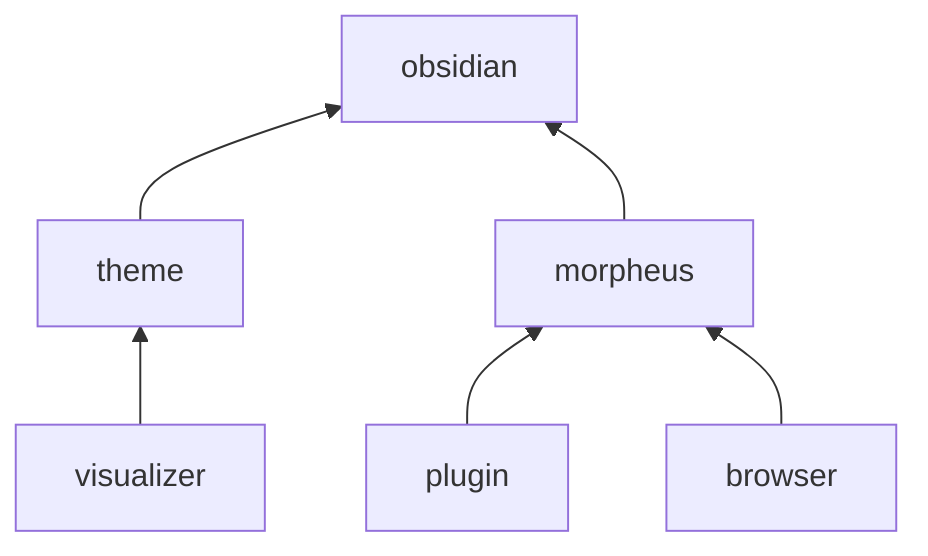
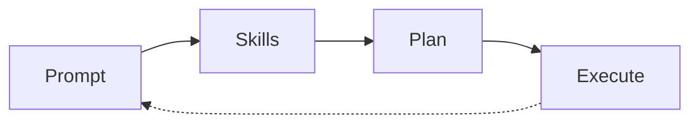

# Table of Contents

- [[Plugin Setup]]
	- [[System prompt]]
	- [[Skill Detection Prompt]]
	- [[Planning prompt]]
- [[Chatting with Morpheus]]
	- [[Use Cases]]

# Discovered Skills

- [[Create Markdown Calendar]]
 
# Architecture and Roadmap


#### Release 1 - Basic
  - [x] Custom green theme and adaptive fonts
  - [x] Basic matrix code visualizer
  - [x] Basic AI chatting with Gemini
  - [x] Chat with page
  - [ ] Use basic skills

# How


When you submit a Prompt it's checked against every Skill individually. A Skill is made up of two sub-prompts, a Trigger Prompt and a Response Prompt. Morpheus creates a 3 message stack and asks the LLM to return `1` if the skill matches the user's prompt based on the [[Skill Detection Prompt]], or `0` otherwise:

```json
[
	{
		role: 'system',
		content: SkillDetectionPrompt
	},
	{
		role: 'user',
		content: UserPrompt
	},
	{
		role: 'system',
		content: Skill
	}
]
```